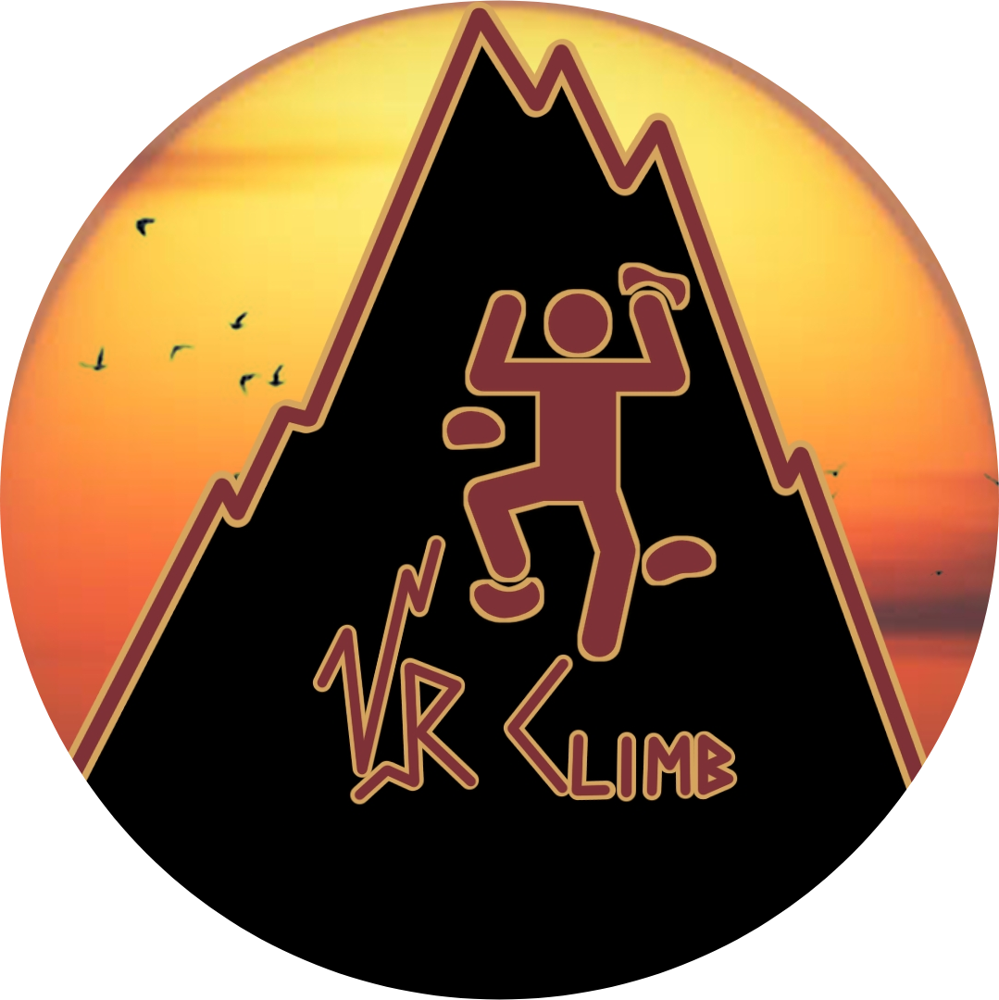
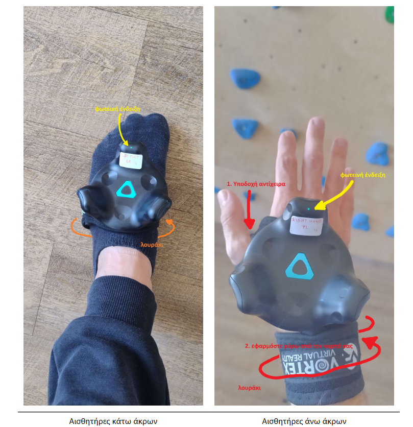
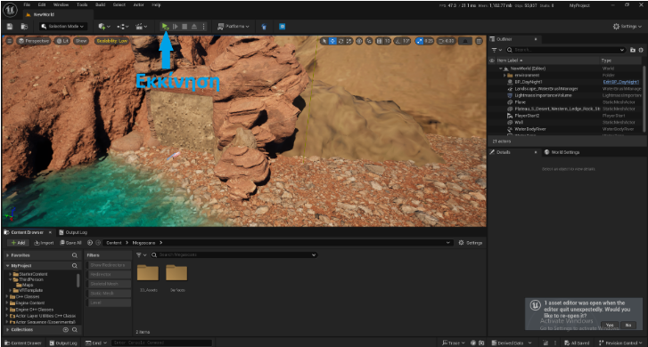
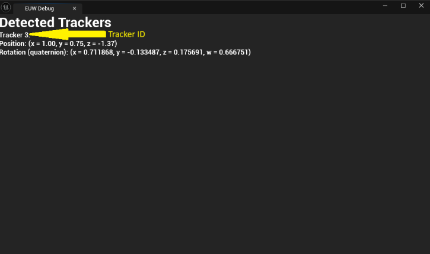
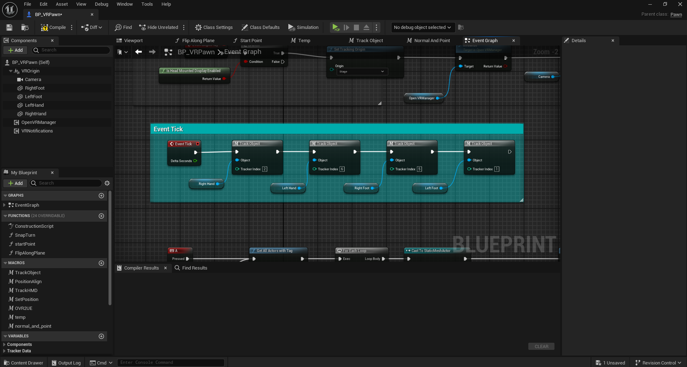
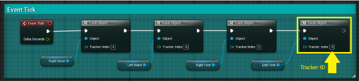
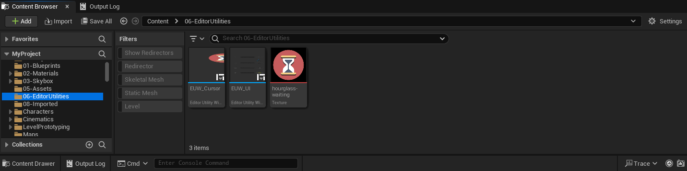
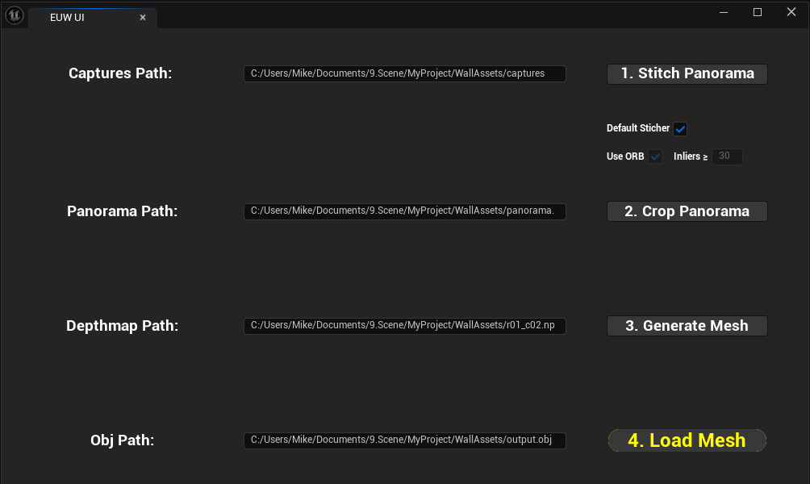

# Οδηγίες εκτέλεσης VR Climb



## Γρήγορη Περιήγηση
1. [Εκκίνηση Εξοπλισμού](#εκκίνηση-εξοπλισμού)
2. [Unreal Engine Project](#unreal-engine-project)
    1. [Αναρρίχηση στο έτοιμο περιβάλλον](#αναρρίχηση-στο-έτοιμο-εικονικό-περιβάλλον)
    2. [Αποσφαλμάτωση - Debugging](#debugging)
    3. [Προετοιμασία περιβάλλοντος - Τροποποίηση τοίχου αναρρίχησης](#προετοιμασία-περιβάλλοντος--τροποποίηση-τοίχου-αναρρίχησης)
    4. [Εικονικός Προπονητής - Ασκήσεις αναρρίχησης](#εικονικός-προπονητής---ασκήσεις-αναρρίχησης)
3. [Αρχικοποίηση Δωματίου](#αρχικοποίηση-δωματίου)
4. [Ιδέες για Μελλοντική Επέκταση](#ιδέες-για-μελλοντική-επέκταση)
5. [Σχόλια για τον προγραμματιστή](#σημειώσεις-προς-τον-προγραμματιστή)
5. [Περισσότερες Πληροφορίες](#περισσότερες-πληροφορίες)

---

## Εκκίνηση Εξοπλισμού

Κατά την είσοδό σας στο δωμάτιο, συνδέστε πρώτα τις 2 συσκευές εντοπισμού (τοποθετημένες στα 2 τρίποδα διαγώνια στον χώρο) στην πρίζα.

- Η συσκευή στην **αριστερή μεριά** του τοίχου αναρρίχησης: πρίζα πίσω της (κόκκινη).
- Η συσκευή **δεξιά της εισόδου**: πρίζα εντός του ντουλαπιού της βιβλιοθήκης.

### Προσοχή

> ⚠ Οι δύο συσκευές εντοπισμού δεν θα πρέπει να αλλάξουν θέση ή προσανατολισμό σε καμία
περίπτωση, καθώς η παραμικρή απόκλιση θα επηρεάσει αρνητικά την λειτουργία και ακρίβεια της
εφαρμογής.
Για τον λόγο αυτό έχουν τοποθετηθεί ειδικές σημάνσεις μαύρου χρώματος στο δάπεδο,
σημειώνοντας την θέση των τριπόδων.

> ⚠ Δώστε ιδιαίτερη προσοχή στην συσκευή κοντά στην είσοδο, της οποίας το καλώδιο διατρέχει το δωμάτιο. Όχι μόνο αποτελεί πιθανή αιτία μετακίνησης της συσκευής εντοπισμού αλλά και τραυματισμού

> ⚠ Στην περίπτωση εκούσιας ή ακούσιας μετακίνησης των συσκευών, καθώς και σε περίπτωση
χρήσης άλλου χώρου, θα πρέπει να ακολουθήσετε τις οδηγίες [Αρχικοποίησης δωματίου](#αρχικοποίηση-δωματίου-steamvr).


Στην συνέχεια, ανοίξτε τον υπολογιστή καθώς και την εφαρμογή SteamVR.

Βεβαιωθείτε ότι 2 USB adaptors είναι συνδεδεμένοι σωστά στις μπροστινές θύρες USB του υπολογιστή.
Τόσο οι adaptors όσο και οι θύρες είναι σημειωμένα με κατάλληλα αναγνωριστικά, `Α`, `Β`. Η θύρα `Β` έχει προεκταθεί με καλώδιο και κατάλληλο USB-A υποδοχέα στην άκρη, τα οποία επίσης έχουν σημειωθεί με το αναγνωριστικό `Β`.

Ενεργοποιήστε τους τέσσερις αισθητήρες κίνησης με την σειρά, σύμφωνα με τον αριθμό (i-iv) που
αναγράφεται πάνω τους, δηλαδή:

- αριστερό πόδι ( i )
- δεξί χέρι ( ii )
- δεξί πόδι ( iii )
- αριστερό χέρι ( iv )

> Ενεργοποίηση των αισθητήρων:
> <br>
> Πιέστε παρατεταμένα το γαλάζιο κουμπί (τριγωνικου σχήματος) στο πάνω μέρος της κάθε συσκευής. Μετά από περίπου 3 δευτερόλεπτα το φωτάκι θα ανάβει σταθερά πράσινο ή μπλε χρώμα. Πράσινο χρώμα υποδηλώνει την κανονική λειτουργία της συσκευής, ενώ μπλε χρώμα υποδηλώνει ότι αυτή βρίσκεται σε λειτουργία συντονισμού με το υπόλοιπο σύστημα.
> <br> Στην περίπτωση που το φωτάκι παραμένει σε μπλε χρώμα, βεβαιωθείτε ότι έχετε ακολουθήσει τα ανωτέρω βήματα συνδεσιμότητας σωστά.
> <br> Πατώντας παρατεταμένα το ίδιο κουμπί ενώ ο αισθητήρας είναι ενεργοποιημένος, αυτός θα μεταβεί πρώτα στην λειτουργία ζεύξης (όπου το χρώμα της λυχνίας led είναι μπλε που αναβοσβήνει) και μετά θα απενεργοποιηθεί, με το λαμπάκι να μένει σβηστό.


> ℹ Περισσότερες πληροφορίες σχετικά με την ενεργοποίηση ή ρύθμιση των αισθητήρων και της μάσκας (HeadMounted Display) μπορείτε να βρείτε στην ενότητα [περισσότερες πληροφορίες](#περισσότερες-πληροφορίες)

Φορέστε τους αισθητήρες στα αντίστοιχα μέλη του σώματός σας, όπως φαίνεται στις ακόλουθες
φωτογραφίες, με το φωτάκι να βρίσκεται πάντα μπροστά.




> ℹ Για τους αισθητήρες των άνω άκρων, περάστε πρώτα τον αντίχειρα στο ειδικό άνοιγμα και σφίξτε
το λουράκι γύρω από τον καρπό σας, φροντίζοντας κατά το δυνατόν ο αισθητήρας να βρίσκεται
στο κέντρο του πίσω μέρους της παλάμης (μετακάρπιο).


> ⚠ Σημειώστε ότι όσο πιο χαλαρή η εφαρμογή, με τον αισθητήρα να "πλέχει" γύρω από το χέρι σας,
τόσο λιγότερο ακριβής θα είναι η παρακολούθηση των κινήσεών σας στο εικονικό περιβάλλον.


Φορέστε την VR μάσκα και βεβαιωθείτε ότι βλέπετε όλα τα tracker στο περιβάλλον του SteamVR.

---

## Unreal Engine Project

Το project VR Climb έχει αναπτυχθεί με χρήση Unreal Engine 5.4.4, ενώ όλα του τα αρχεία βρίσκονται στον φάκελο 

```
C:\Users\Mike\Documents\9.Scene\MyProject
```
Ακολούθως παρατίθεται μια σύντομη επεξήγηση των κυριότερων αρχείων και φακέλων της εργασίας.
| Αρχείο             | Τύπος                       | Περιγραφή                                                                                        |
|--------------------|-----------------------------|--------------------------------------------------------------------------------------------------|
| MyProject.uproject | Unreal Engine Project (📄)  | Το κυρίως αρχείο του πρότζεκτ. Σημείο εισόδου για εκτέλεση και επεξεργασία.                      |
| MyProject.sln      | Visual Studio Solution (📄) | Σημείο εισόδου για τροποποίηση ή/και build του πηγαίου κώδικα.                                   |
| Documentation.md   | Αρχείο Markdown (📄)        | Περιέχει τον παρόντα οδηγό χρήσης της εφαρμογής.                                                 |
| Bug-ReadMe.txt     | Αρχείο κειμένου (📄)        | Οδηγίες για πλήρες εκ νέου build του project.                                                    |
| WallAssets         | (📁)                        | Αρχεία που σχετίζονται με την παραγωγή του εικονικού τοίχου αναρρίχησης.                         |
| Scripts            | (📁)                        | Πηγαίος κώδικας python που σχετίζεται αποκλειστικά με την παραγωγή εικονικού τοίχου αναρρίχησης. |
| ThirdParty         | (📁)                        | Standalone βιβλιοθήκες στην C++ (Eigen, OpenVR, ZED camera)                                      |
| Source             | (📁)                        | Πηγαίος κώδικας του project σε C++ (Day/Night Cycle, Import wall κλπ).                           |
| Content            | (📁)                        | Όλα τα assets του πρότζεκτ, προσβάσιμα μέσω του content browser στο Unreal Editor.               |

> ℹ️ Για το αρχείο `MyProject.uproject` που αποτελεί το κυρίως κομμάτι της υλοποίησης έχει επίσης δημιουργηθεί συντόμευση στην επιφάνεια εργασίας.

Το κυρίως "επίπεδο" με την εικονική ονομάζεται `NewWorld` έχει ρυθμιστεί ως η προεπιλογή εμφάνισης κατά την εκκίνηση.

> ℹ️ Σε περίπτωση που επιθυμείτε να τροποποιήσετε το περιβάλλον χειροκίνητα μέσω του Unreal Editor και δεν έχετε εμπειρία με game development σε unreal engine, μπορείτε να ξεκινήσετε [εδώ](https://dev.epicgames.com/documentation/en-us/unreal-engine/unreal-engine-for-new-users).

Ο Content Browser επιτελεί ρόλο αντίστοιχο του προγράμμαοτς περιήγησης αρχείων του υπολογιστή σας.

Ακολούθως παρατίθεται σύντομη επεξήγηση των κυριότερων φακέλων του Content Browser.
| Όνομα φακέλου      | Περιγραφή                                                                                                                                                                              |
|--------------------|----------------------------------------------------------------------------------------------------------------------------------------------------------------------------------------|
| 00-Maps            | Διάφορα επίπεδα του κόσμου. Κάθε επίπεδο αποτελεί μια ανεξάρτητη σκηνή. Το επίπεδο NewWorld είναι το κυρίως επίπεδο, ενώ τα υπόλλοιπα αποτελούν δοκιμές ή/και προηγούμενες υλοποιήσεις |
| 01-Bluperints      | Αρχεία γραφικού κώδικα της UE. Το σημαντικότερο εξ' αυτών, BP_VRPawn χειρίζεται την κίνηση του χρήστη στο περιβάλλον.                                                                  |
| 02-Materials       | Εικόνες (textures) και υλικά (materials) του κόσμου                                                                                                                                    |
| 03-Skybox          | Αρχεία και ρυθμίσεις του ουράνιου θόλου.                                                                                                                                               |
| 05-Assets          | Διάφορα αντικείμενα του περιβάλλοντος, καθώς και άλλα στοιχεία όπως το VR Menu                                                                                                                                       |
| 06-EditorUtilities | Αρχεία τύπου πίνακα ελέγχου για χρήση εντός του Editor. Το αρχείο EUW_UI είναι υπεύθυνο για την ανακατασκευή του τοίχου αναρρίχησης                                                    |
| 08-Imported        | Assets που γίνονται import αυτόματα, δηλαδή η τρισδιάστατη αναπαράσταση του τοίχου.                                                                                                    |

### Αναρρίχηση στο έτοιμο εικονικό περιβάλλον

Αφού ακολουθήσετε όλα τα βήματα της ενότητας [Εκκίνηση Εξοπλισμού](#εκκίνηση-εξοπλισμού) ανοίξτε το αρχείο `MyProject.uproject` ή την συντόμευσή του στην επιφάνεια εργασίας.

Στην συνέχεια, πατήστε το πλήκτρο `Play` στο κέντρο του πάνω μέρους της οθόνης και απολαύστε την εμπειρία αναρρίχησης σε VR περιβάλλον!

Για να διακόψετε την λειτουργία της εφαρμογής πατήστε το κουμπί esc στο πληκτρολόγιο.

|               |
|:----------------------------------------------------------------:|
|Η αρχική οθόνη της εφαρμογής όπου σημειώνεται το κουμπί εκκίνησης.|

### Debugging

Στην ενότητα αυτή παρατίθενται οδηγίες αποσφλαμάτωσης για την μη σωστή απεικόνιση των άκρων στο εικονικό περιβάλλον.

Παραδείγματα πιθανών προβλημάτων περιλαμβάνουν την μη εμφάνιση ενός ή περισσότερων άκρων ή/και την αναντιστοιχία απεικονιζόμενου/-ων και πραγματικού/-ών μέλους/-ών.

> ℹ Στην συντριπτική τους πλειοψηφία, τέτοια προβλήματα προκύπτουν λόγω ενεργοποίησης του συστήματος με λάθος σειρά. Ως πρώτη προσπάθεια (quick fix) απενεργοποιήστε τον υπολογιστή και όλον τον εξοπλισμό και ενεργοποιήστε των εκ νέου, ακολουθώντας αυστηρά την σειρά που περιγράφεται στην ενότητα εκκίνηση εξοπλισμού.

Εντός της εφαρμογής έχει προστεθεί ένα μενού (υπό την μορφή ενός Editor Utility Widget) που μπορεί να βοηθήσει στην αποσφαλμάτωση. Κατευθυνθείτε στον φάκελο `Content Browser > 06-EditorUtilities > EUW_Debug`. Πραγματοποιήστε δεξί κλικ και επιλέξτε την πρώτη ενέργεια, `Run Editor Utility Widget`.
Στην οθόνη εμφανίζονται όλοι οι trackers που έχουν ανιχνευτεί, όπως φαίνεται στην ακόλουθη εικόνα. Στην συνέχεια, κουνώντας μόνο έναν tracker την φορά (από αυτούς που παρουσιάζουν πρόβλημα) μπορείτε να εντοπίσετε το ID του, το οποίο και θα πρέπει να σημειώσετε.


|                        |
|:----------------------------------------------------------------:|
|EUW_Debug. Έχει ενεργοποιηθεί μόνο ο tracker i (αριστερό πόδι) του οποίου το ID είναι 3. Από κάτω φαίνεται η θέση και ο προσανατολισμός του.|

Στην συνέχεια, αφού καταγράψετε τα IDs όλων των trackers, κατευθυνθείτε στο αρχείο `Content Browser > 01-Blueprints > BP_VRPawn` και κάντε διπλό κλικ σε αυτό.

||
|:----------------------------------------------------------------:|
|Στιγμιότυπο από το εσωτερικό του αρχείου BP_VRPawn.               |

Προσεκτικά, κάντε δεξί κλικ στον κενό χώρο και κρατώντας το δεξί πλήκτρο πατημένο μετακινηθείτε (panning) μέχρι να εντοπίσετε το εικονιζόμενο κυανό πλαίσιο `Event Tick`.

> ℹ Μπορείτε επίσης να χρησιμοποιήσετε την ροδέλα του ποντικιού για να εντοπίσετε το πλαίσιο ευκολότερα.

> ℹ Στην περίπτωση που αφήσετε το δεξί πλήκτρο χωρίς να μετακινηθείτε, θα ενεργοποιηθεί ένα μενού επιλογών το οποίο αφενός δεν επηρεάζει την διαδικασία και αφετέρου μπορείτε να το κλείσετε με ένα αριστερό κλικ σε οποιοδήποτε σημείο του κενού χώρου.

Μόλις πλοηγηθείτε στο πλαίσιο `Event Tick`, το μόνο που θα πρέπει να τροποποιήσετε είναι το πεδίο `Tracker Index` όπου θα πρέπει να αναγράψετε τον αντίστοιχο αριθμό/ID του κάθε tracker, ώστε να αντιστοιχηθεί με καθένα μέλος του σώματος.

||
|:------------------------------------------------------:|
|Εντός του αρχείου BP_VRPawn, στην περιοχή Event Tick τροποποιούμε το τελευταίο πλαίσιο, που αντιστοιχεί στο αριστερό πόδι, συμπληρώνοντας το προσημειωθέν ID (3).|


### Προετοιμασία Περιβάλλοντος – Τροποποίηση Τοίχου Αναρρίχησης

Στην ενότητα αυτή περιγράφεται βήμα-βήμα η διαδικασία κατασκευής ενός εικονικού τοίχου κατ'αντιστοιχία ενός πραγματικού τοίχου αναρρίχησης και η τοποθέτησή του στο εικονικό περιβάλλον.

Στην ενότητα δεν γίνεται αναφορά στην τροποποίηση του ίδιου του περιβάλλοντος και των υπόλοιπων στοιχείων του (ποταμού, βράχων, εδάφους, ουράνιου θόλου), τα οποία μπορούν να τροποποιηθούν βάσει των γνώσεων και κατ' ευθύνη του εκάστοτε προγραμματιστή.

Κατ' επέκταση της προηγούμενης σημείωσης, η εικονική ανακατασκευή ενός άλλου τοίχου, εκτός αυτού που βρίσκεται στις εγκαταστάσεις του VVR Group του τμήματος ΗΜΤΥ του Πανεπιστημίου Πατρών ενδέχεται να μην ταιριάζει με το εικονικό περιβάλλον. Ειδικότερα, το εικονικό περιβάλλον (π.χ. θέση του
ποταμού) έχει κατασκευαστεί με γνώμονα το συγκεκριμένο δωμάτιο, υποβαθμίζοντας την εμπειρία του χρήστη αν αυτούσιο χρησιμοποιηθεί σε άλλο χώρο.

#### Βήμα 1 – Φωτογράφιση
Τραβήξτε φωτογραφίες του τοίχου αναρρίχησης που θέλετε να ανακατασκευάσετε 

>ℹ Για την φωτογράφιση μπορείτε να χρησιμοποιήσετε το κινητό σας τηλέφωνο.

> ⚠ Η ποιότητα ανακατασκευής εξαρτάται από τις λήψεις που θα πραγματοποιηθούν. Ακολουθείστε προσεκτικά τις παρακάτω οδηγίες (αναγράφονται με σειρά προτεραιότητας)

- Οι λήψεις θα πρέπει να γίνουν "γραμμικά" δηλαδή να βρίσκονται με την σειρά - στον οριζόντιο ή κάθετο άξονα. (πάνω → κάτω, κάτω → πάνω, αριστερά → δεξιά, ή - δεξιά → αριστερά).
- Ως εκ τούτου, φροντίστε ολόκληρο το πλάτος ή ύψος του τοίχου (για κατακόρυφη ή - οριζόντια κίνηση αντίστοιχα) να περιέχεται σε κάθε λήψη.
- Διατηρείστε σταθερή απόσταση από τον τοίχο σε όλες τις λήψεις.
- Μεταξύ των διαδοχικών λήψεων θα πρέπει να υπάρχει κάποια επικάλυψη.
- Κρατήστε την κάμερα κατά το δυνατόν κάθετα στον τοίχο (μια υποθετική ακτίνα που εκπέμπεται από την κάμερα θα πρέπει να προσπίπτει κάθετα στο επίπεδο του τοίχου και ως εκ τούτου, για στην περίπτωση συμβατικής φωτογραφικής μηχανής ή κινητού τηλεφώνου η οθόνη της θα βρίσκεται παράλληλα με τον τοίχο).

>📋 Παράδειγμα
(Διαδικασία λήψης των φωτογραφιών που χρησιμοποιήθηκαν και βρίσκονται στον υπολογιστή τουεργαστηρίου)
><br>
>
> Σταθείτε απέναντι από την αριστερή πλευρά του τοίχου αναρρίχησης και σε απόσταση περίπου ενός μέτρου από αυτόν. Κρατήστε το κινητό σας τηλέφωνο σε όρθια θέση, παράλληλα στον τοίχο, περίπου στο ύψος των ματιών. Προσαρμόστε (προσεγγιστικά, στο μέτρο του το δυνατού) την θέση και τον προσανατολισμό του τηλεφώνου, ώστε η αριστερή, πάνω και κάτω άκρες της φωτογραφίας να ευθυγραμμίζονται με τις αντίστοιχες πλευρές του τοίχου. Τραβήξτε μια φωτογραφία. Κάντε ένα μεσαίο βήμα στα δεξιά, φροντίζοντας αφενός οι επάνω και κάτω άκρες της επόμενης λήψης να μείνουν σε ευθυγράμμιση με τον τοίχο και αφετέρου να υπάρχει επικάλυψη με την προηγούμενη φωτογραφία. Αφού τραβήξετε και την δεύτερη φωτογραφία, κάντε ένα ακόμα βήμα προς τα δεξιά και επαναλάβετε την διαδικασία έως ότου οι (5-7) διαδοχικές φωτογραφίες καλύψουν ολόκληρο το μήκος του τοίχου.

#### Βήμα 2 - Μεταφορά
Μεταφέρετε τις φωτογραφίες στον υπολογιστή σας, σε έναν φάκελο.

#### Βήμα 3 - Εκτέλεση μενού εισαγωγής στο περιβάλλον
Ανοίξτε την Unreal Engine και στην συνέχεια τον `Content Browser` (αν δεν είναι ήδη ανοιχτός στο κάτω μέρος της οθόνης, πατήστε `ctrl+space`) και πλοηγηθείτε στον φάκελο `06-EditorUtilities`. Κάντε δεξί κλικ στο αρχείο `EUW_UI` και επιλέξτε την πρώτη ενέργεια, `Run Editor Utility Widget`.

||
|:------------------------------:|
|Η διαδρομή για το μενού ανακατασκευής του τοίχου `Content Browser > 06-EditorUtilities > EUW_UI`.|

|        |
|:----------------------------------------------:|
|Το μενού της εφαρμογής ανακατασκευής του τοίχου.|

#### Βήμα 4 - 'Συρραφή' φωτογραφιών
Μόλις ανοίξει το UI της εφαρμογής εισάγετε στο πρώτο πλαίσιο πλαίσιο κειμένου (Captures Path) τον φάκελο όπου προηγουμένως μεταφέρατε τις εικόνες.

Προτείνεται να κρατήσετε την επιλογή "default stitcher" (της OpenCV) ενεργοποιημένη, καθώς φαίνεται να έχει το καλύτερο αποτέλεσμα.

Απενεργοποιώντας της επιλογή μπορείτε να πειραματιστείτε με τον εναλλακτικό stitcher που αναπτύχθηκε. Στην περίπτωση αυτή, ξεκλειδώνεται η επιλογή χρήσης ή όχι του ORB feature detector και συνακολούθως το πλήθος των inliers για παραμετροποίηση της συρραφής εικόνων. Σε περίπτωση αποεπιλογής του ORB detector ο SIFT detector θα χρησιμοποιηθεί.

> ℹ Ο αλγόριθμος SIFT προσφέρει εν δυνάμει μεγαλύτερη ακρίβεια, ειδικά σε περιπτώσεις που αφορούν μεγάλη διαφορά σε κλίμακα και περιστροφή μεταξύ των εικόνων, ενώ ο αλγόριθμος ORB είναι συχνά γρηγορότερος και πιο αποδοτικός.

Αφού επιλέξετε τις επιθυμητές ρυθμίσεις, και αφού εισάγετε τον επιθυμητό φάκελο όπου θα αποθηκευτεί το συνολικό πανόραμα πατήστε το κουμπί 1.Stitch Panorama για να ξεκινήσετε την διαδικασία συρραφής (stitching) των επιμέρους φωτογραφιών σε μία ενιαία.

#### Βήμα 5 - Περικοπή πανοράματος
Μετά την διαδικασία συρραφής, προχωρήστε στην περικοπή της συνολικής εικόνας πατώντας το κουμπί `2. Crop Panorama`

Στο παράθυρο που εμφανίζεται θα δείτε το αποτέλεσμα της συρραφής καθώς και ένα τετράπλευρο σχήμαμπλε χρώματος. Μετακινείστε τις γωνίες του σχήματος ώστε να περικόψετε τον τοίχο αναρρίχησης από το υπόλοιπο περιβάλλον που τυχόν φωτογραφήθηκε κατά λάθος (π.χ. ταβάνι ή πάτωμα του δωματίου).

> ℹ Η καινούρια, περικομμένη φωτογραφία θα αντικαταστήσει την φωτογραφία πανοράματος στο σημείο του υπολογιστή όπου καθορίστηκε προηγουμένως.

#### Βήμα 6 - Δημιουργία mesh
Καθορίστε επίσης τις διαδρομές (path) του αρχείου του χάρτη βάθους που θα χρησιμοποιηθεί για κανονικοποίηση στο πεδίο Depthmap Path καθώς και του αρχείου όπου θα αποθηκευτεί η δομή (mesh) του τρισδιάστατου τοίχου στο πεδίο Obj Path.

> ⚠ Φροντίστε ώστε το το αρχείο του χάρτη βάθους να είναι τύπου .npy (Numpy Array binary file) και το αρχείο αποθήκευσης του ανακατασκευασμένου τοίχου να είναι .obj (Geometry definitionfile).

> ℹ Μπορείτε κάλλιστα να χρησιμοποιήσετε το δικό μας αρχείο βάθους που βρίσκεται στον φάκελο C:/Users/Mike/Documents/9.Scene/MyProject/WallAssets/r01_c02.pny και στο github αποθετήριο της εργασίας ως [DepthMap_example.npy](../12.Results/DepthMap_example.npy), καθώς θα χρησιμοποιηθεί αποκλειστικά για κανονικοποίηση.

Στην συνέχεια, πατήστε το κουμπί `3. Generate Mesh`.

> ℹ Η διαδικασία ανακατασκευής του τοίχου είναι μια υπολογιστικά απαιτητική διαδικασία με πολλά βήματα και ως εκ τούτου αναμένεται να διαρκέσει αρκετά λεπτά.
> <br>
> Ενδεικτικός χρόνος αναμονής: ~ 10min

#### Βήμα 7 - Εισαγωγή στο εικονικό περιβάλλον

Τέλος, πατήστε το κουμπί `4. Load Mesh` το οποίο θα διαγράψει το προηγούμενο μοντέλο του τοίχου και θα φορτώσει αυτό που έχει αποθηκευτεί στην διαδρομή του πεδίου Obj Path, στην προκαθορισμένη θέση του στην σκηνή και με τον προκαθορισμένο προσανατολισμό και μέγεθος.

### Εικονικός Προπονητής - Ασκήσεις αναρρίχησης

Στην εφαρμογή έχει προστεθεί δυνατότητα ζωντανής (live) επίδειξης ασκήσεων αναρρίχησης, με στόχο την εκπαίδευση ή στοχευμένη προπόνηση μυϊκών ομάδων του χρήστη.

Για να εκκινήσετε την διαδικασία, γυρίστε την παλάμη του δεξιού σας χεριού προς τα πάτω, ώστε να δείχνει το ταβάνι της αίθουσας. Θα ενεργοποιηθεί τότε ένα μενού εντός της εφαρμογής εικονικής πραγματικότητας.

Το μενού αυτό ακολουθεί την κίνηση του δεξιού σας χεριού στο χώρο, παραμένει όμως πάντα παράλληλο στον τοίχο αναρρίχησης. Έτσι, θα πρέπει να κοιτάτε προς τον τοίχο για να μπορέσετε να αλληλεπιδράσετε με το μενού. Το μενού μπορεί να απενεργοποιηθεί εάν στρέψετε την παλάμη του δεξιού χεριού κατά 180° ώστε να δείχνει προς τα κάτω.

Στην αριστερή πλευρά του μενού βρίσκονται διάφορες ασκήσεις αναρρίχησης, μαζί με μία σύντομη περιγραφή της καθεμίας από αυτές.

Για όση ώρα το μενού είναι ενργοποιημένο, το αριστερό σας χέρι μπορεί να χρησιμοποιηθεί ως εικονικός κέρσορας. Μπορείτε να δείξετε (hover) με αυτό το κουμπί μιας άσκησης από την λίστα αριστερά, ώστε να δείτε την προεπισκόπησή της στο δεξί μέρος του μενού.

Με το αριστερό σας χέρι μπορείτε επίσης να επιλέξετε (hover) τα κουμπιά "Cancel" και "Play" στο κάτω δεξί μέρος της οθόνης. Το πρώτο θα κλείσει απλά το μενού, όμοια με την κίνηση του δεξιού χεριού που περιγράφθηκε παραπάνω. Το κουμπί "Play" θα κλείσει επίσης το μενού και ο εικονικός προπονητής θα επιδείξει την επιλεγμένη άσκηση ζωντανά και με ακρίβεια επί του τοίχου αναρρίχησης.

## Αρχικοποίηση Δωματίου (SteamVR)

Σε περίπτωση μεταβολής του χώρου εργασίας για οποιονδήποτε λόγο (π.χ. μετακίνηση ή αλλαγή προσανατολισμού των trackers) θα πρέπει να ακολουθήσετε την διαδικασία αρχικοποίησης δωματίου μέσα από την εφαρμογή SteamVR, πραγματοποιώντας ουσιαστικά ένα καλιμπράρισμα του χώρου.

Συμπερασματικά, από την αντίθετη πλευρά, δεν προτείνεται να ακολουθήσετε αυτή την διαδικασία επαναφοράς των ρυθμίσεων εργασίας, εαν όλα βαίνουν καλώς και δεν πραγματοποιήθηκε καμία αλλαγή από την προηγούμενη εκτέλεση.

Για να ξεκινήσετε την διαδικασία, τοποθετήστε τα 2 trackers στην πρίζα, ανοίξτε τον Η/Υ και στην συνέχεια την εφαρμογή SteamVR όπως περιγράφηκε στην ενότητα [εκκίνηση εξοπλισμού](#εκκίνηση-εξοπλισμού).

Εντός της εφαρμογής SteamVR επιλέξτε το κουμπί του μενού στην άνω αριστερή γωνία (☰) και από εκεί την πρώτη επιλογή, Room Setup. Επιλέξτε Room Scale και ακολουθήστε βήμα βήμα τις οδηγίες που θα εμφανιστούν στην οθόνη σας.

Ακολούθως παρατίθενται κάποιες συμβουλές και παρεκκλίσεις από την προεπιλεγμένη διαδικασία, προς διευκόλυνσή σας και καλύτερη λειτουργία της εφαρμογής.

- Για καλύτερο ορισμό του δαπέδου του δωματίου χρησιμοποιήστε και τα 2 VR - χειριστήρια (οι οδηγίες του SteamVR απαιτούν τουλάχιστον 1).
- Στο στάδιο ορισμού των ορίων του δωματίου (set room boundaries) προτείνεται να - επιλέξετε το κουμπί advanced mode το οποίο θα σας επιτρέψει να πατήσετε απλώς - την σκανδάλη του ενός χειριστηρίου στις 4 γωνίες του χώρου. Σε διαφορετική - περίπτωση, θα χρειαστεί να ιχνηλατήσετε (trace) την περίμετρο του χώρου, - κρατώντας συνεχώς την σκανδάλη πατημένη. Εκτός από άβολο, κάτι τέτοιο - ενδέχεται να δημιουργήσει σφάλματα σε κάποια σημεία της περιμέτρου.
- Στο στάδιο εντοπισμού της οθόνης, προτείνεται αντ' αυτού να στρέψετε το - χειριστήριο προς τον τοίχο αναρρίχησης.
- Τέλος, αποσκοπώντας στην εξάλειψη σφαλμάτων ταυτοποίησης των trackers λόγω της - χρήσης των χειριστηρίων, προτείνεται να μην ανοίξετε τα trackers καθ' όλη την - διάρκεια της ρύθμισης δωματίου.
- Ειδικότερα, πραγματοποιήστε την αρχικοποίηση δωματίου μετά από (επαν-)εκκίνηση του υπολογιστή, έχοντας ενεργοποιήσει μόνο την εφαρμογή SteamVR και τα 2 χειριστήρια. Μόλις τελειώσει η διαδικασία, απενεργοποιήστε τα χειριστήρια και τον υπολογιστή και στην συνέχεια ακολουθείστε τα βήματα της ενότητας [εκκίνησης εξοπλισμού](#εκκίνηση-εξοπλισμού) από την αρχή για να χρησιμοποιήσετε την εφαρμογή VRClimb.

## Ιδέες για Μελλοντική Επέκταση

- Επέκταση/Τροποποίηση του χώρου αναρρίχησης
    - προσθήκη εικονικής σπηλιάς<br>(εύσημα ιδέας: Κωνσταντίνος Μουστάκας)
    - αναρρίχηση σε μεγαλύτερο εικονικό υψόμετρο.
    - ανρρίχηση σε "άπειρο τοίχο".<br>(εύσημα ιδέας: Κωνσταντίνος Μουστάκας)
    - προσθήκη προστατευτικών ασφαλείας στον χώρο.
- Προσθήκη συστήματος καιρού στο εικονικό περιβάλλον.
- Προσθήκη χλωρίδας και διάνθιση της πανίδας.
    - Διάδραση της χλωρίδας και πανίδας με το περιβάλλον, ανάλογα την εποχή, τις καιρικές συνθήκες και την ώρα της ημέρας.
- Υλοποίηση ακριβέστερου συστήματος αντιστοίχησης του ψηφιακού και του πραγματικού κόσμου.
- Βελτίωση της πιστότητας ανακατασκευής του τοίχου.
- Επέκταση του εικονικού προπονητή.

## Σημειώσεις προς τον προγραμματιστή

Παρότι έχει ήδη αναφερθεί σε πολλά σημεία, θα πρέπει να είναι ξεκάθαρο σε όποιον προγραμματιστή ασχοληθεί με το VRClimb, ότι η ανάπτυξή -παρελθοντική ή μελλοντική- του μπορεί να καταμεριστεί σε τουλάχιστον τέσσερα ανεξάρτητα μεν, αλληλοσυμπληρούμενα δε στάδια.

1. Ανάπτυξη του εικονικού περιβάλλοντος.
2. Ανακατασκευή του τοίχου αναρρίχησης.
3. Αντιστοίχηση και συγχρονισμός των πραγματικών και ψηφιακών κινήσεων του χρήστη.
4. Ανάπτυξη συτήματος εικονικής εκπαίδευσης και προπόνησης.

Τυχόν τροποποίηση και βελτίωση του ενός σταδίου, μπορεί να θεωρήσει όλα τα υπόλοιπα ως δεδομένα και ως επί το πλείστον να μην ασχοληθεί καθόλου με αυτά.

Ακολούθως παρουσιάζονται συνοπτικές σημειώσεις για καθένα από αυτά τα στάδια προς βοήθεια του προγαρρματιστή.

#### Ανάπτυξη του εικονικού περιβάλλοντος.
Αποτελεί το πιο "καλλιτεχνικό" κομμάτι της εργασίας και ίσως το πιο εύκολα προβάσιμο σε έναν αρχάριο, λόγω των διευκολύνσεων και εργαλέιων που παρέχει η Unreal Engine.

Σε επαγγελματικό επίπεδο ανάπτυξης βιντεοπαιχνιδιών, σχετίζεται κυρίως με τον ρόλο του <u>**Level Designer**</u>. Άλλες υποχρεώσεις και ειδικεύσεις που αφορούν το πως ο χρήστης αντιλαμβάνεται το εικονικό περιβάλλον (π.χ. <u>**Sound Designing**</u>, <u>**Optimization**</u>) επίσης εμπίπτουν για τους σκοπούς της εργασίας στο στάδιο αυτό. Όποιος επιθυμεί να βελτιώσει την εφαρμογή σε αυτό το επίπεδο, προτείνεται να εξοικιωθεί πρωτίστως με την Unreal Engine και την διαχείρηση των assets για την δημιουργία μίας σκηνής. Βέβαια, το στάδιο αυτό είναι το πλέον ευρύ και απαιτεί ακόμα και χρήση κώδικα (π.χ. στο αρχείο `MoonController.cpp` το οποίο είναι υπεύθυνο για την εμφάνιση της σελήνης στον ουράνιο θώλο.) ή/και Blueprints.

Λίγες ιδέες για ενδεχόμενες μελλοντικές επεκτάσεις αναφέρονται στην [σχετική ενότητα](#ιδέες-για-μελλοντική-επέκταση).

#### Ανακατασκευή του τοίχου αναρρίχησης.
Αποτελεί το πιο τεχνικό ίσως στάδιο της εργασίας, καθώς αφορά το κομμάτι της υπολογιστικής όρασης (<u>**Computer Vision**</u>). Ο σχετικός κώδικας έχει γραφθεί σε αρχεία python, τα οποία βρίσκονται στον φάκελο `Scripts`. Η ένταξη του ανακατασκευασμένου τοίχου στο περιβάλλον, γίνεται με την βοήθεια του αρχείου `Source/MyProject/Private/Importer.cpp`

Σε περίπτωση που κάποιος επιθυμεί να βελτιώσει αυτό το κομμάτι της εργασίας, θα είχε ενδιαφέρον να διερευνήσει την χρήση κάποιας κάμερας όπως η ZED που αντιλαβάνεται το βάθος, έρευνα που εν τέλει δεν απέδωσε καρπούς για τον γράφοντα.

#### Αντιστοίχηση και συγχρονισμός των πραγματικών και ψηφιακών κινήσεων του χρήστη.
Θεωρητικά, η χαρτογράφηση των κινήσεων του χρήστη και η αντιστοίχησή τους στην εικονική σκηνή θα έπρεπε να πραγματοποιείται εύκολα μέσα από την unreal engine. Καθότι αυτό δεν κατέστη δυνατόν, πραγματοποιήθηκε μια «<u>**Engineering**</u>» (αρκετά <u>**μαθηματική**</u> αλλά και σε μεγάλο βαθμό προσεγγιστική) υλοποίηση. Ως εκ τούτου, υπάρχει αρκετός χώρος για βελτίωση της ακρίβειας αντιστοίχησης κινήσων. Σε περίπτωση που κάποιος επιθυμεί να ασχοληθεί με αυτό το κομμάτι, θα πρέπει να ανατρέξει τόσο στο αρχείο `OpenVRManager.cpp`, όσο και στο αρχείο `BP_VRPawn`, το οποίο ως αρχείο οπτικού προγραμματισμού μέσω nodes είναι υπεύθυνο για την διαχείρηση του χρήστη του εικονικού περιβάλλοντος.

#### Ανάπτυξη συτήματος εικονικής εκπαίδευσης και προπόνησης.
Το στάδιο αυτό, υλοποιήθηκε τελευταίο και έτσι είναι σε μεγάλο βαθμό ημιτελές. Άπτεται μεν σε κομμάτια των γραφικών υπολογιστών, όπως το <u>**Animation**</u>, αλλά επίσης απλώνεται στον κλάδο των επιστημών υγείας, αγγίζοντας τομείς όπως η <u>**κινισεολογία**</u>, <u>**η φυσική αγωγή**</u>, η <u>**φυσικοθεραπεία**</u> και βεβαίως ίδια η επαγγελματική <u>**αναρρίχηση**</u>.

Απώτερος στόχος του σταδίου αυτού είναι η δημιουργία ενός πλήρως διαδραστικού μενού, όπου ο χρήστης θα μπορεί να δει διάφορες ασκήσεις αναρρίχησης, μαζί με μία σύντομη περιγραφή τους και των μυών που γυμνάζουν. Επιλέγοντας μία άσκηση, ένα ρεαλιστικό μοντέλο του ανθρώπινου σώματος επιδεικνύει την άσκηση, υπογραμμίζοντας τα σημεία όπου θα πρέπει να αγγίξει ο χρήστης, αλλά και τονίζοντας κατάλληλα τους μύες που ενεργοποιούνται με την άσκηση αυτή. Για το σκοπό αυτό αξιοποιούνται τα assets των φακέλων `Content/05-Assets/menu` και `Content/05-Assets/HumanAnatomy` το αρχείο blueprint `01-Blueprints/BP_Trainer.uasset` καθώς και ο φάκελος `Content\09-Animations` για την διαδικασία animation του μοντέλου. Τέλος, σημειώνεται ότι η εικόνα (texture) `05-Assets/HumanAnatomy/Textures/cc_muscles` δημιουργήθηκε ακριβώς για να διευκολύνη του διαχωρισμού των μυών. Για την υλοποίηση του σταδίου αυτού απαιτείται επίσης αναζήτηση στην βιβλιογραφία με ενδεικτικές λέξεις κλειδιά "Muscle Activation in a Rock Climbing wall".

---

Έχοντας αφιερώσει ένα σημαντικό χρονικό διάστημα ασχολούμενος με το VRClimb, θεωρώ αυτό το πρότζεκτ ως ένα σημαντικό "σκαλοπάτι", τόσο σε επαγγελματικό όσο και σε προσωπικό επίπεδο. Θα ήμουν ιδιαίτερα χαρούμενος αν οποιοσδήποτε ασχοληθεί μελλοντικά με αυτό επικοινωνήσει μαζί μου, προκειμένου να συζητήσουμε ή ακόμα και να συννεργαστούμε για την συννέχιση του έργου.

## Περισσότερες Πληροφορίες

### Χρήσιμα Links
- [Vive Pro HMD Setup Guide](https://www.vive.com/us/setup/vive-pro-hmd/)
- [Vive Pro HMD Setup Guide (Unofficial)](https://www.youtube.com/watch?v=gVVkVHu9zvw)
- [Πώς να φορέσετε την μάσκα VR](https://www.youtube.com/watch?v=EBUXPv76E3Q)
- [Χαρακτηριστικά συστήματος και εγχειρίδιο χρήστη](https://developer.vive.com/resources/hardware-guides/vive-pro-specs-user-guide/)
- [Vive Tracker Manual](https://dl.vive.com/Tracker/Guideline/HTC_Vive_Tracker(2018)_Developer+Guidelines_v1.0.pdf)
- [Οδηγός Χρήσης των trackers](https://developer.vive.com/resources/hardware-guides/vive-tracker-developer-guidelines/)
- [SteamVR αρχικοποίηση δωματίου](https://www.youtube.com/watch?v=OhQBIbHE-qE)

### Διπλωματική εργασία
https://nemertes.library.upatras.gr/items/7d1b8cc3-ada4-4f26-b048-3c3ce71b72ba

### Github Repository
https://github.com/FireCoder-N/VRClimb

### Επικοινωνία
- dimnestmanolis@gmail.com, 699295771 (Νέστορας)
- moustakas@ece.upatras.gr (Κωνσταντίνος Μουστάκας, Υπεύθυνος Καθηγητής)